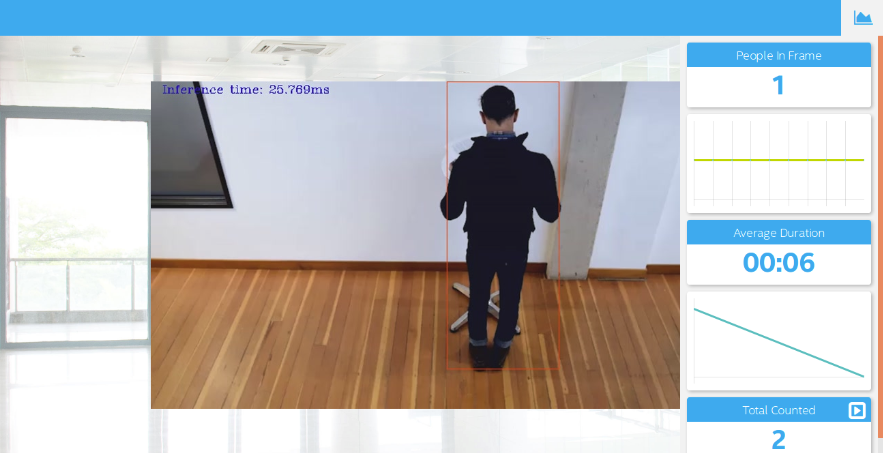
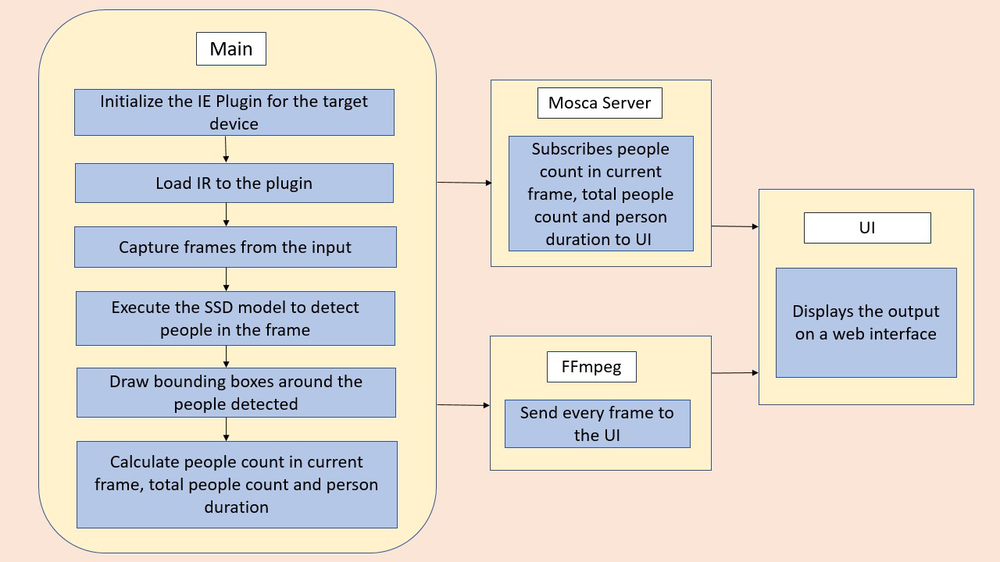

# Deploy a People Counter App at the Edge

| Details            |              |
|-----------------------|---------------|
| Programming Language: |  Python 3.5 or 3.6 |



## What it Does

The people counter application will demonstrate how to create a smart video IoT solution using Intel® hardware and software tools. The app will detect people in a designated area, providing the number of people in the frame, average duration of people in frame, and total count.

## How it Works

The counter will use the Inference Engine included in the Intel® Distribution of OpenVINO™ Toolkit. The model used should be able to identify people in a video frame. The app should count the number of people in the current frame, the duration that a person is in the frame (time elapsed between entering and exiting a frame) and the total count of people. It then sends the data to a local web server using the Paho MQTT Python package.

You will choose a model to use and convert it with the Model Optimizer.



## Requirements

### Hardware

* 6th to 10th generation Intel® Core™ processor with Iris® Pro graphics or Intel® HD Graphics.
* OR use of Intel® Neural Compute Stick 2 (NCS2)
* OR Udacity classroom workspace for the related course

### Software

*   Intel® Distribution of OpenVINO™ toolkit 2019 R3 release
*   Node v6.17.1
*   Npm v3.10.10
*   CMake
*   MQTT Mosca server
  
        
## Setup

### Install Intel® Distribution of OpenVINO™ toolkit

Utilize the classroom workspace, or refer to the relevant instructions for your operating system for this step.

- [Linux/Ubuntu](./linux-setup.md)
- [Mac](./mac-setup.md)
- [Windows](./windows-setup.md)

### Install Nodejs and its dependencies

Utilize the classroom workspace, or refer to the relevant instructions for your operating system for this step.

- [Linux/Ubuntu](./linux-setup.md)
- [Mac](./mac-setup.md)
- [Windows](./windows-setup.md)

### Install npm

There are three components that need to be running in separate terminals for this application to work:

-   MQTT Mosca server 
-   Node.js* Web server
-   FFmpeg server
     
From the main directory:

* For MQTT/Mosca server:
   ```
   cd webservice/server
   npm install
   ```

* For Web server:
  ```
  cd ../ui
  npm install
  ```
  **Note:** If any configuration errors occur in mosca server or Web server while using **npm install**, use the below commands:
   ```
   sudo npm install npm -g 
   rm -rf node_modules
   npm cache clean
   npm config set registry "http://registry.npmjs.org"
   npm install
   ```

## What model to use

It is up to you to decide on what model to use for the application. You need to find a model not already converted to Intermediate Representation format (i.e. not one of the Intel® Pre-Trained Models), convert it, and utilize the converted model in your application.

Note that you may need to do additional processing of the output to handle incorrect detections, such as adjusting confidence threshold or accounting for 1-2 frames where the model fails to see a person already counted and would otherwise double count.

**If you are otherwise unable to find a suitable model after attempting and successfully converting at least three other models**, you can document in your write-up what the models were, how you converted them, and why they failed, and then utilize any of the Intel® Pre-Trained Models that may perform better.

## Run the application

From the main directory:

### Step 1 - Start the Mosca server

```
cd webservice/server/node-server
node ./server.js
```

You should see the following message, if successful:
```
Mosca server started.
```

### Step 2 - Start the GUI

Open new terminal and run below commands.
```
cd webservice/ui
npm run dev
```

You should see the following message in the terminal.
```
webpack: Compiled successfully
```

### Step 3 - FFmpeg Server

Open new terminal and run the below commands.
```
sudo ffserver -f ./ffmpeg/server.conf
```

### Step 4 - Run the code

Open a new terminal to run the code. 

#### Setup the environment

You must configure the environment to use the Intel® Distribution of OpenVINO™ toolkit one time per session by running the following command:
```
source /opt/intel/openvino/bin/setupvars.sh -pyver 3.5
```

You should also be able to run the application with Python 3.6, although newer versions of Python will not work with the app.

#### Running on the CPU

When running Intel® Distribution of OpenVINO™ toolkit Python applications on the CPU, the CPU extension library is required. This can be found at: 

```
/opt/intel/openvino/deployment_tools/inference_engine/lib/intel64/
```

*Depending on whether you are using Linux or Mac, the filename will be either `libcpu_extension_sse4.so` or `libcpu_extension.dylib`, respectively.* (The Linux filename may be different if you are using a AVX architecture)

Though by default application runs on CPU, this can also be explicitly specified by ```-d CPU``` command-line argument:
If you wish to enable the Alert on Larger Gathering in a Frame use the ``` -al <Limit of People(int)>``` command-line argument:
If you wish to configure the frames to ignore to prevent double counting use the ``` -fe <Number of Frames(int)>``` command line argument.

**Configured Frame Ignores for Different Models and Exmaples of Commands are available [here](https://github.com/swastiknath/iot_ud_1/blob/master/commands.txt)**.

```
python main.py -i resources/Pedestrian_Detect_2_1_1.mp4 -m your-model.xml -l /opt/intel/openvino/deployment_tools/inference_engine/lib/intel64/libcpu_extension_sse4.so -d CPU -pt 0.6 | ffmpeg -v warning -f rawvideo -pixel_format bgr24 -video_size 768x432 -framerate 24 -i - http://0.0.0.0:3004/fac.ffm
```
If you are in the classroom workspace, use the “Open App” button to view the output. If working locally, to see the output on a web based interface, open the link [http://0.0.0.0:3004](http://0.0.0.0:3004/) in a browser.

#### Running on the Intel® Neural Compute Stick

To run on the Intel® Neural Compute Stick, use the ```-d MYRIAD``` command-line argument:

```
python3.5 main.py -d MYRIAD -i resources/Pedestrian_Detect_2_1_1.mp4 -m your-model.xml -pt 0.6 | ffmpeg -v warning -f rawvideo -pixel_format bgr24 -video_size 768x432 -framerate 24 -i - http://0.0.0.0:3004/fac.ffm
```

To see the output on a web based interface, open the link [http://0.0.0.0:3004](http://0.0.0.0:3004/) in a browser.

**Note:** The Intel® Neural Compute Stick can only run FP16 models at this time. The model that is passed to the application, through the `-m <path_to_model>` command-line argument, must be of data type FP16.

#### Using a camera stream instead of a video file

To get the input video from the camera, use the `-i CAM` command-line argument. Specify the resolution of the camera using the `-video_size` command line argument.

For example:
```
python main.py -i CAM -m your-model.xml -l /opt/intel/openvino/deployment_tools/inference_engine/lib/intel64/libcpu_extension_sse4.so -d CPU -pt 0.6 | ffmpeg -v warning -f rawvideo -pixel_format bgr24 -video_size 768x432 -framerate 24 -i - http://0.0.0.0:3004/fac.ffm
```

To see the output on a web based interface, open the link [http://0.0.0.0:3004](http://0.0.0.0:3004/) in a browser.

**Note:**
User has to give `-video_size` command line argument according to the input as it is used to specify the resolution of the video or image file.

## A Note on Running Locally

The servers herein are configured to utilize the Udacity classroom workspace. As such,
to run on your local machine, you will need to change the below file:

```
webservice/ui/src/constants/constants.js
```

The `CAMERA_FEED_SERVER` and `MQTT_SERVER` both use the workspace configuration. 
You can change each of these as follows:

```
CAMERA_FEED_SERVER: "http://localhost:3004"
...
MQTT_SERVER: "ws://localhost:3002"
```
## Explaining Custom Layers

The Custom layers of certain Single Shot Detection models which are transformed into Intermediate Representation are certainly the layers those do all the post processing. CPU cannot process the calculations by default without using a custom layer library. In this case they are the following layers:

  - DetectionOutput: which provides number, confidence and co-ordinates of the bounding boxes in (xmin, ymin) and (xmax, ymax) format. 
  
  - PriorBoxClustered: which are actually different bounding boxes drawn acorss the detected object across different sliding windows. These PriorBoxClustered Layers are later concatenated together, resized and presented as Detection Output. 
  
### Reasons for handling Custom Layers:
In order to draw the bounding boxes only with the detected objects where detection confidence is greater than a pre-specified threshold the Intermediate Representation uses **PriorBoxClustered** and **DetectionOutput** custom layers. In this scenario, we are also aiming to produce a model which can go ahead and detect persons in every frame of a video. 

### Handling the Custom Layers:
We can handle the above said custom layers using the **MKLDNN** Library for CPU which is available with OpenVino Installation at the following location:
```
<INSTALL_DIR>/openvino/deployment_tools/inference_engine/lib/intel64/libcpu_extension_sse4.so
```
We add the above said library as an extension to the **IECore()** object of the model before actually loading the IR files. 

## Comparing Model Performance:

Let us now compare the performance between the original and the converted to Intermediate Representation Models using the Model Optimizer of the Intel Distribution of OpenVino Toolkit 2019.R3.


### SIZE DIFFERENCES BETWEEN THE **IR** AND THE ORIGINAL MODEL FILES:
We get to know the sizes of the different models via the use of the **wget** command for the pre-conversion downloaded archives. We can get to know the Post-conersion sizes via the following block of code that I wrote.

```
import os
total_size = 0
start_path = '<REPLACE WITH IR DIRECTORY>'  # To get size of current directory
for path, dirs, files in os.walk(start_path):
    for f in files:
        fp = os.path.join(path, f)
        total_size += os.path.getsize(fp)
print("Directory size: " + str(total_size*1e-6)+" Megabytes")
 ```
 
 | Name of the Model     |   Pre-Conversion Size       |  Post Conversion Size      |
 |-----------------------|---------------|---------------|
 | SSD INCEPTION V2      |             265.23 MB       |              100.24 MB     |
 | SSD MOBILENET V2      |              106 MB         |               64 MB        |
 | SSDLite MOBILENET V2  |              112 MB         |             18.023 MB      |
 | SSD MOBILENET OID V2  |              179 MB         |                27 MB       |
 | Intel Person  Detection Retail - 0013 - FP32/FP16/INT8       |                              |                   9.09 MB         |
                                                   
                                                    
 


### INFERENCE TIME DIFFERENCES BETWEEN THE **IR** AND THE ORIGINAL MODEL FILES:

We get to know about the model's pre-conversion inference timings from the [Tensorflow Detection Model Zoo]('https://github.com/tensorflow/models/blob/master/research/object_detection/g3doc/detection_model_zoo.md). The Post-conversion stats are found via printing the infrence time for each frame to the video output sent to the FFMPEG server.

 
 | Name of the Model    |Pre-conversion Inference (ms) | Post-coversion Inference(ms)|
|-----------------------|---------------|---------------|
 | SSD INCEPTION V2     |                       42     |                       152   |
 | SSD MOBILENET V2     |                       31     |                        45   |
 | SSDLite MOBILENET V2 |                       27     |                        25   |
 | SSD MOBILENET OID V2 |                       89     |                        64   |
 | Intel Person Detection Retail - 0013 - FP32  |                              |                     15        |

## Assess Model Use Cases

### Use Cases of the People Counter Application:

 - Security: We can deploy the people counter application along with the security cameras to look for intruders. We can detect mobbing or stampede too as the application sends out a message to the MQTT if the current count of people in the frame is greater than a specified number. 
 
 - Smart Queing Systems: We can use this application as a baseline to create an application that can perform smart queing based on the number of people in the current frame. 
 
 - Counting the Total Number of People in a Place: We can deploy the application in a surveillance camera. By feeding the footage from the camera we will be able to count the total number of people on a public gathering like a festival, or a stadium etc.
 
 - Airline Boarding: We can use this application in a airline boarding place where we can measure the average duration of boading of a passanger to an aircraft and scrutinize in case of delay and use these telemetry to evaluate the customer satisfaction. 

As the application is opensource, further modifications can be made to adapt to further different use cases than the ones described earlier. 

## Assess Effects on End User Needs

Lighting, model accuracy, and camera focal length/image size have different effects on a
deployed edge model. The potential effects of each of these are as follows...

### Efficiency Scenario for Model Accuracy:

The models specifically the ones from the Tensorflow OpenModel Zoo are pre-trained and are used here with their freezed inference graph, with no retraining or whatsoever. The ones with SSD Inception, SSD MobileNet and SSDLite were trained with COCO Image dataset along with different objects. So, the performance is quite a big issue here. In few of the frames while using these models we were able to see that the models are unable to detect the person standing backwards. We must say, in order to improve the accuracy we must train it with our own dataset in compliance with the Transfer Learning. 

### Efficiency Scenario for Lightning Conditions, Camera Focal Lenth / Image Size:

The original camera feed image size is not ofcourse a problem, beacuse we have addressed that issue by getting the model's input size prioritites and have applied the resize transformation over the images. However with higher resolution videos frame by frame resizing becomes computationally expensive and takes a significant amount of time. 

As discussed earlier the models are pretrained and proper lighting is needed in order to parse people from the images. With insufficient the model will fail to detect people in the frame. 

The camera focal length will also play a signifacnt role, if the image is outfocused the model will not be able to detect any person entering or exiting the frames. 


## Model Research

I actually aimed towards models that uses the SSD (Single Shot Multi Box Detection) Algorithm, because they tend to perform the inference faster and more efficiently with the edge devices with the constraints of limited computing resources. 
In investigating potential people counter models, I tried each of the following three models:

- Model 1: [SSD Inception V2]
  - [Tensorflow Model Zoo Github](http://download.tensorflow.org/models/object_detection/ssd_inception_v2_coco_2018_01_28.tar.gz)
  - I extracted the model archive and used the **frozen_inference_graph.pb** and **pipeline.config files** along with the **ssd_v2_support.json** file from the OpenVino Toolkit Model Optimizer to transform the model into the IR format. 
  ```
  wget http://download.tensorflow.org/models/object_detection/ssd_inception_v2_coco_2018_01_28.tar.gz
  tar -xvf ssd_inception_v2_coco_2018_01_28.tar.gz
  /opt/intel/openvino/deployment_tools/model_optimizer/mo_tf.py --input_model ssd_inception_v2_coco_2018_01_28/frozen_inference_graph.pb --tensorflow_use_custom_operations_config /opt/intel/openvino/deployment_tools/model_optimizer/extensions/front/tf/ssd_v2_support.json --tensorflow_object_detection_api_pipeline_config ssd_inception_v2_coco_2018_01_28/pipeline.config --reverse_input_channel -o ssd_inception

  ```
  - The model's latency was medium around 152 milliseconds. Accuracy was not quite reliable, as it, in some intermediate frames not detecting person facing backwards. So I had to use 15 frames and probability to around 0.4 to make certain to not to  double count a person. 
  
- Model 2: [SSD MobileNet V2]
  - [Tensorflow Model Zoo Github](http://download.tensorflow.org/models/object_detection/ssd_mobilenet_v2_coco_2018_03_29.tar.gz)
  - I extracted the model archive and used the **frozen_inference_graph.pb** and **pipeline.config files** along with the **ssd_v2_support.json** file from the OpenVino Toolkit Model Optimizer to transform the model into the IR format. 
  ```
  wget http://download.tensorflow.org/models/object_detection/ssd_mobilenet_v2_coco_2018_03_29.tar.gz
  tar -xvf ssd_mobilenet_v2_coco_2018_03_29.tar.gz
  /opt/intel/openvino/deployment_tools/model_optimizer/mo_tf.py --input_model ssd_mobilenet_v1_coco_2018_01_28/frozen_inference_graph.pb  --tensorflow_use_custom_operations_config /opt/intel/openvino/deployment_tools/model_optimizer/extensions/front/tf/ssd_support.json --tensorflow_object_detection_api_pipeline_config ssd_mobilenet_v1_coco_2018_01_28/pipeline.config --reverse_input_channel -o ssd_mbl_v1

  ```
  - The model was quite appropriate in terms of detecting the people facing backwards. It counted the people with +-1 and Duration with +- 2 units. I have set the probability threshold to 0.7 in order to avoid the double counts and frames to skip to 9. But still in some intermediate frames in some videos sometimes it fails to properly draw the bounding boxes. In the app to accomodate this issue I have implemented to igonre such intermediate miscalculations. 

- Model 3: [SSDLite Mobilenet V2 Trained on COCO Image Dataset.]
  - [Tensorflow Model Zoo](http://download.tensorflow.org/models/object_detection/ssdlite_mobilenet_v2_coco_2018_05_09.tar.gz)
  - I extracted the model archive and used the **frozen_inference_graph.pb** and **pipeline.config files** along with the **ssd_v2_support.json** file from the OpenVino Toolkit Model Optimizer to transform the model into the IR format.
  ```
  wget http://download.tensorflow.org/models/object_detection/ssdlite_mobilenet_v2_coco_2018_05_09.tar.gz
  tar -xvf ssdlite_mobilenet_v2_coco_2018_05_09.tar.gz
  rm -r ssdlite_mobilenet_v2_coco_2018_05_09.tar.gz

  /opt/intel/openvino/deployment_tools/model_optimizer/mo_tf.py --input_model ssdlite_mobilenet_v2_coco_2018_05_09/frozen_inference_graph.pb --tensorflow_use_custom_operations_config /opt/intel/openvino/deployment_tools/model_optimizer/extensions/front/tf/ssd_v2_support.json --tensorflow_object_detection_api_pipeline_config ssdlite_mobilenet_v2_coco_2018_05_09/pipeline.config --reverse_input_channel -o ssdlite_mobilenet 
  ```
  - The model not was quite appropriate in terms of detecting the people facing backwards althought the inference speed was very fast inference latency was around 25 milliseconds. I had to set the probability threshold to very low to get it working. It counted the people with +-1 and Duration with +- 2 units. I have set the probability threshold to 0.3 in order to avoid the double counts and frames to skip to 15. But still in some intermediate frames in some videos sometimes it fails to properly draw the bounding boxes. In the app to accomodate this issue I have implemented to igonre such intermediate miscalculations 

- Model 4: [SSD Mobilenet V2 Trained on OpenImagesDataset]:
  - [Tensorflow Model Zoo](http://download.tensorflow.org/models/object_detection/ssd_mobilenet_v2_oid_v4_2018_12_12.tar.gz)
  - I extracted the model archive and used the **frozen_inference_graph.pb** and **pipeline.config files** along with the **ssd_v2_support.json** file from the OpenVino Toolkit Model Optimizer to transform the model into the IR format.
  ```
  wget http://download.tensorflow.org/models/object_detection/ssd_mobilenet_v2_oid_v4_2018_12_12.tar.gz
  tar -xvf ssd_mobilenet_v2_oid_v4_2018_12_12.tar.gz
  rm -r ssd_mobilenet_v2_oid_v4_2018_12_12.tar.gz

  /opt/intel/openvino/deployment_tools/model_optimizer/mo_tf.py --input_model ssd_mobilenet_v2_oid_v4_2018_12_12/frozen_inference_graph.pb --tensorflow_use_custom_operations_config /opt/intel/openvino/deployment_tools/model_optimizer/extensions/front/tf/ssd_v2_support.json --tensorflow_object_detection_api_pipeline_config ssd_mobilenet_v2_oid_v4_2018_12_12/pipeline.config --reverse_input_channel -o ssd_oivd_mobilenet
  ```
  - The model's performance was not reliable, inference time was medium around 65 milliseconds. I was not properly drawing the bounding boxes and not properly calculating duration at all. Even after setting 15 frames and probability threshold to 0.4 it was unable to provide reliable performance. 
